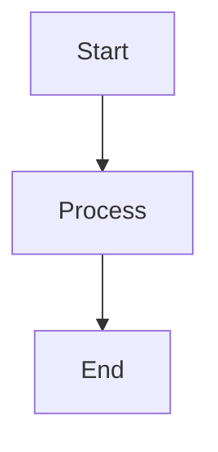

# Confluence Exporter

[](https://www.npmjs.com/package/conflu-exporter)
[](https://opensource.org/licenses/MIT)
[](https://nodejs.org)
[](https://www.typescriptlang.org/)
[](https://pnpm.io/)

A powerful CLI tool and TypeScript library for exporting Confluence pages and spaces to Markdown format with full fidelity preservation for future sync capabilities.

## Features

- 🚀 **CLI Tool**: Command-line interface for easy exports
- 📄 **Export Formats**: Markdown with diagram source code preservation (PDF/DOCX support coming soon)
- 🎨 **Mermaid Diagrams**: Exports Mermaid diagrams as source code in markdown code fences
- 📦 **Batch Operations**: Export multiple pages, entire spaces, or from URLs
- 🔄 **Sync-Ready**: Full metadata preservation for future bidirectional sync
- 🖼️ **Attachments**: Download images and files at original resolution
- 🔐 **Secure Auth**: API token authentication with environment variable support
- 📊 **Progress Tracking**: Real-time progress indicators for batch operations
- 🎯 **Type-Safe**: Full TypeScript support with comprehensive type definitions

## Installation

### Global Installation (CLI)

```bash
npm install -g conflu-exporter
# or
pnpm add -g conflu-exporter
# or
yarn global add conflu-exporter
```

### Local Installation (Library)

```bash
npm install conflu-exporter
# or
pnpm add conflu-exporter
# or
yarn add conflu-exporter
```

## CLI Usage

### Authentication

You can authenticate in three ways (priority: CLI flags → Environment variables → Config file):

**Environment Variables** (Recommended):

```bash
export CONFLUENCE_BASE_URL="https://your-domain.atlassian.net"
export CONFLUENCE_EMAIL="your-email@example.com"
export CONFLUENCE_TOKEN="your-api-token"
```

**Config File** (`.conflurc`):

```json
{
  "baseUrl": "https://your-domain.atlassian.net",
  "email": "your-email@example.com",
  "format": "markdown",
  "output": "./exports",
  "includeAttachments": true
}
```

**CLI Flags**:

```bash
conflu export page 123456 -e your-email@example.com -t your-token -u https://your-domain.atlassian.net
```

### Export Commands

#### Export Single Page

```bash
# Basic page export
conflu export page 123456

# With attachments
conflu export page 123456 --include-attachments

# Custom output directory
conflu export page 123456 -o ./my-exports

# Dry run (preview without exporting)
conflu export page 123456 --dry-run
```

#### Export Entire Space

```bash
# Export all pages in a space
conflu export space MYSPACE

# Include child pages recursively
conflu export space MYSPACE --include-children

# Flat structure (no hierarchy)
conflu export space MYSPACE --flat

# With attachments
conflu export space MYSPACE --include-attachments
```

#### Export from URL

```bash
# Export page from URL (auto-detects page ID)
conflu export url "https://your-domain.atlassian.net/wiki/spaces/TEAM/pages/123456/Page+Title"

# Export entire space from URL
conflu export url "https://your-domain.atlassian.net/wiki/spaces/TEAM/overview"
```

#### Batch Export

Export multiple pages from a JSON or CSV file:

**JSON Format** (`batch-export.json`):

```json
[
  {
    "pageId": "123456",
    "title": "Product Requirements"
  },
  {
    "pageId": "789012",
    "title": "Architecture Overview"
  },
  {
    "pageId": "345678"
  }
]
```

**CSV Format** (`batch-export.csv`):

```csv
pageId,title
123456,Product Requirements
789012,Architecture Overview
345678
```

**Run Batch Export**:

```bash
# From JSON file
conflu export batch examples/batch-export.json

# From CSV file
conflu export batch examples/batch-export.csv --include-attachments
```

### Global Options

```bash
conflu [command] [options]

Options:
  -v, --verbose     Enable verbose logging
  -q, --quiet       Suppress all output except errors
  -V, --version     Output version number
  -h, --help        Display help for command
```

### Output Structure

```
exports/
├── SPACE-KEY/
│   ├── page-title.md
│   ├── another-page.md
│   └── assets/
│       ├── page-id-1/
│       │   ├── image1.png
│       │   └── diagram.svg
│       └── page-id-2/
│           └── screenshot.jpg
├── manifest.json
└── export-log.txt
```

## Key Features

### Diagram Source Code Preservation

**Mermaid Diagrams**: The tool automatically extracts Mermaid diagram source code and exports it as markdown code fences:

**Confluence Page**:

```
{mermaid}
graph TD
  A[Start] --> B[Process]
  B --> C[End]
{mermaid}
```

**Exported Markdown**:

````markdown

````

This ensures diagrams can be edited and re-rendered after export, maintaining full compatibility for future sync operations.

### Full Metadata Preservation

Each exported page includes comprehensive frontmatter metadata:

```yaml
---
title: 'Page Title'
confluenceId: '123456'
confluenceSpaceKey: 'TEAM'
confluenceVersion: 5
confluenceCreatedBy: 'user@example.com'
confluenceCreatedAt: '2025-01-01T10:00:00Z'
confluenceUpdatedAt: '2026-01-07T12:00:00Z'
confluenceParentId: '789012'
confluenceLabels: ['documentation', 'api']
macros:
  mermaid: 2
  code: 5
exportedAt: '2026-01-07T14:30:00Z'
---
```

This metadata enables:

- **Change detection** for incremental updates
- **Bidirectional sync** compatibility
- **Page relationship** preservation
- **Version tracking** for conflict resolution

### Content Fidelity

- **Images**: Downloaded at original resolution with metadata
- **Links**: Preserved with page IDs for future linking
- **Code Blocks**: Language and source code fully preserved
- **Diagrams**: Source code extraction for DrawIO, Gliffy, Lucidchart
- **Panels**: Info, warning, note panels converted to blockquotes
- **Macros**: All Confluence macros documented in metadata

## Documentation

Comprehensive guides to help you get started and master `conflu-exporter`:

### Getting Started

- **[Installation Guide](docs/INSTALLATION.md)** - Step-by-step installation for all platforms
- **[Quick Start Guide](docs/QUICK_START.md)** - Get up and running in 5 minutes
- **[Authentication Guide](docs/AUTHENTICATION.md)** - Secure credential management

### Reference

- **[Command Reference](docs/COMMAND_REFERENCE.md)** - Complete guide to all CLI commands
- **[Configuration Reference](docs/CONFIGURATION.md)** - All configuration options explained
- **[Troubleshooting Guide](docs/TROUBLESHOOTING.md)** - Solutions to common issues

### Advanced

- **[Use Cases & Examples](docs/USE_CASES.md)** - Real-world scenarios and solutions
- **[Best Practices](docs/BEST_PRACTICES.md)** - Security, performance, and optimization tips

### Development & Publishing

- **[Auto-Publish Setup](docs/AUTO_PUBLISH_SETUP.md)** - How to set up automatic publishing to npm and GitHub Packages

### Quick Links

| I want to...                | Go to...                                                                        |
| --------------------------- | ------------------------------------------------------------------------------- |
| Install the tool            | [Installation Guide](docs/INSTALLATION.md)                                      |
| Export my first page        | [Quick Start](docs/QUICK_START.md#step-4-your-first-export)                     |
| Set up authentication       | [Authentication Guide](docs/AUTHENTICATION.md)                                  |
| Export an entire space      | [Command Reference - export space](docs/COMMAND_REFERENCE.md#export-space)      |
| Batch export multiple pages | [Command Reference - export batch](docs/COMMAND_REFERENCE.md#export-batch)      |
| Fix an error                | [Troubleshooting Guide](docs/TROUBLESHOOTING.md)                                |
| Automate exports            | [Use Cases - CI/CD Integration](docs/USE_CASES.md#cicd-integration)             |
| Optimize performance        | [Best Practices - Performance](docs/BEST_PRACTICES.md#performance-optimization) |

## Library Usage

### Basic Example

```typescript
import { ConfluenceExporter } from 'conflu-exporter'

const exporter = new ConfluenceExporter({
  baseUrl: 'https://your-domain.atlassian.net',
  auth: {
    username: 'your-email@example.com',
    token: 'your-api-token',
  },
  format: 'markdown',
})

// Export an entire space
const result = await exporter.exportSpace('MYSPACE')
console.log(`Exported ${result.pages.length} pages`)

// Export a single page
const page = await exporter.exportPage('123456')
console.log(`Page title: ${page.title}`)
```

### Configuration Options

```typescript
interface ExporterOptions {
  baseUrl: string // Required: Confluence instance URL
  auth?: {
    username?: string
    token?: string
  }
  format?: 'markdown' | 'html' | 'json' // Default: 'markdown'
  includeAttachments?: boolean // Default: false
}
```

### Utility Functions

```typescript
import { formatDate, sanitizeFilename, extractSpaceKey } from 'conflu-exporter'

// Format a date to ISO string
const isoDate = formatDate(new Date())

// Sanitize filenames for safe file system usage
const safeName = sanitizeFilename('My Page: Title (2024)!')

// Extract space key from Confluence URL
const spaceKey = extractSpaceKey('https://example.atlassian.net/wiki/spaces/MYSPACE/pages/123')
```

## 📚 Documentation

### CI/CD & Publishing

- [GitHub Actions Build & Publish](docs/AUTO_PUBLISH_SETUP.md) - CI/CD workflow documentation
- [NPM Token Setup Guide](docs/NPM_TOKEN_SETUP.md) - Complete guide for setting up npm authentication
- [Token Verification Script](scripts/verify-npm-token.sh) - Test your npm token before publishing

### Quick Help

- **Troubleshooting npm publish errors?** → See [NPM_TOKEN_SETUP.md](docs/NPM_TOKEN_SETUP.md)
- **Need to verify your token?** → Run `./scripts/verify-npm-token.sh YOUR_TOKEN`
- **404 or ENEEDAUTH errors?** → Check [Troubleshooting section](docs/NPM_TOKEN_SETUP.md#-troubleshooting)

## Development

### Setup

```bash
# Install dependencies
pnpm install

# Run tests
pnpm test

# Run tests with UI
pnpm test:ui

# Run tests with coverage
pnpm test:coverage

# Build the library
pnpm build

# Type checking
pnpm type-check

# Linting
pnpm lint
pnpm lint:fix

# Format code
pnpm format
pnpm format:check
```

### Project Structure

```
conflu-exporter/
├── src/
│   ├── index.ts          # Main entry point
│   ├── exporter.ts       # Core exporter class
│   ├── types.ts          # TypeScript type definitions
│   └── utils.ts          # Utility functions
├── tests/
│   ├── exporter.test.ts  # Exporter tests
│   └── utils.test.ts     # Utility tests
├── dist/                 # Build output
└── package.json
```

## API Reference

### ConfluenceExporter

The main class for interacting with Confluence.

#### Methods

- `exportSpace(spaceKey: string): Promise<ExportResult>` - Export all pages from a space
- `exportPage(pageId: string): Promise<ConfluencePage>` - Export a single page
- `getFormat(): string` - Get the configured export format

### Types

```typescript
interface ConfluencePage {
  id: string
  title: string
  content: string
  spaceKey: string
  version?: number
  createdAt?: Date
  updatedAt?: Date
}

interface ExportResult {
  success: boolean
  pages: ConfluencePage[]
  errors?: string[]
}
```

## License

MIT

## Contributing

Contributions are welcome! Please feel free to submit a Pull Request.
