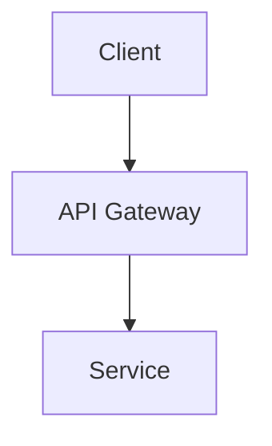

# Quick Start Guide

Get up and running with `conflu-exporter` in 5 minutes.

## Table of Contents

- [Prerequisites](#prerequisites)
- [Step 1: Installation](#step-1-installation)
- [Step 2: Get Confluence Credentials](#step-2-get-confluence-credentials)
- [Step 3: Set Up Authentication](#step-3-set-up-authentication)
- [Step 4: Your First Export](#step-4-your-first-export)
- [Step 5: Explore Exported Files](#step-5-explore-exported-files)
- [Next Steps](#next-steps)

## Prerequisites

Before you begin, ensure you have:

- ✅ Node.js 18.0+ installed
- ✅ Access to a Confluence instance
- ✅ 5 minutes of time

## Step 1: Installation

Install `conflu-exporter` globally:

```bash
npm install -g conflu-exporter
```

Verify installation:

```bash
conflu --version
# Expected: 0.1.0
```

✅ **Success!** The tool is installed.

## Step 2: Get Confluence Credentials

You need three pieces of information:

### 2.1 Confluence Base URL

Your Confluence instance URL (without /wiki at the end):

```
✅ Correct: https://your-company.atlassian.net
❌ Wrong:   https://your-company.atlassian.net/wiki
```

### 2.2 Your Email Address

The email address associated with your Atlassian account:

```
your-email@company.com
```

### 2.3 API Token

Generate an API token:

1. Go to https://id.atlassian.com/manage-profile/security/api-tokens
2. Click **"Create API token"**
3. Give it a name (e.g., "conflu-exporter")
4. Click **"Create"**
5. **Copy the token** (you won't see it again!)

```
Your token will look like: ATBBxyz...abc123
```

> 🔒 **Security Tip**: Never share your API token or commit it to version control!

## Step 3: Set Up Authentication

Choose one of three methods:

### Method A: Environment Variables (Recommended)

Set environment variables for your session:

**macOS/Linux**:
```bash
export CONFLUENCE_BASE_URL="https://your-company.atlassian.net"
export CONFLUENCE_EMAIL="your-email@company.com"
export CONFLUENCE_TOKEN="your-api-token-here"
```

**Windows (PowerShell)**:
```powershell
$env:CONFLUENCE_BASE_URL="https://your-company.atlassian.net"
$env:CONFLUENCE_EMAIL="your-email@company.com"
$env:CONFLUENCE_TOKEN="your-api-token-here"
```

**Make it permanent** (add to `~/.zshrc` or `~/.bashrc` on macOS/Linux):
```bash
echo 'export CONFLUENCE_BASE_URL="https://your-company.atlassian.net"' >> ~/.zshrc
echo 'export CONFLUENCE_EMAIL="your-email@company.com"' >> ~/.zshrc
echo 'export CONFLUENCE_TOKEN="your-api-token-here"' >> ~/.zshrc
source ~/.zshrc
```

### Method B: Config File

Create a `.conflurc` file in your home directory:

```bash
# Create config file
cat > ~/.conflurc << 'EOF'
{
  "baseUrl": "https://your-company.atlassian.net",
  "email": "your-email@company.com",
  "token": "your-api-token-here",
  "output": "./exports",
  "format": "markdown",
  "includeAttachments": true
}
EOF
```

> ⚠️ **Important**: Add `.conflurc` to `.gitignore` if working in a Git repository!

### Method C: Command-Line Flags

Pass credentials with each command:

```bash
conflu export page <pageId> \
  -u https://your-company.atlassian.net \
  -e your-email@company.com \
  -t your-api-token-here
```

## Step 4: Your First Export

Let's export a Confluence page!

### 4.1 Find a Page ID

**Option A: From URL**

When viewing a Confluence page, the URL contains the page ID:

```
https://your-company.atlassian.net/wiki/spaces/TEAM/pages/123456/Page+Title
                                                                  ^^^^^^
                                                                Page ID
```

**Option B: Use URL Export (Easiest)**

You can also export directly from the page URL:

```bash
conflu export url "https://your-company.atlassian.net/wiki/spaces/TEAM/pages/123456/Page+Title"
```

### 4.2 Run Your First Export

Export a single page:

```bash
# If using environment variables or config file:
conflu export page 123456

# Or with command-line flags:
conflu export page 123456 \
  -u https://your-company.atlassian.net \
  -e your-email@company.com \
  -t your-api-token-here
```

You should see output like:

```
Starting export of page 123456...
Testing API connection...
✓ Connected to Confluence API
Fetching page 123456...
✓ Fetched page: "Getting Started Guide"
Converting page to markdown...
✓ Converted to markdown (15234 chars)
✓ Saved page: exports/TEAM/getting-started-guide.md
✓ Saved manifest: exports/manifest.json

✓ Export complete!

Exported files:
  Page: exports/TEAM/getting-started-guide.md
  Manifest: exports/manifest.json
```

✅ **Success!** Your page has been exported.

### 4.3 Export with Attachments

To download images and attachments:

```bash
conflu export page 123456 --include-attachments
```

Output:

```
...
Downloading attachments...
✓ Downloaded 5 attachments

Exported files:
  Page: exports/TEAM/getting-started-guide.md
  Assets: exports/TEAM/assets/123456/
  Manifest: exports/manifest.json
```

## Step 5: Explore Exported Files

Navigate to the export directory:

```bash
cd exports
ls -la
```

You'll see:

```
exports/
├── TEAM/                           # Space directory
│   ├── getting-started-guide.md   # Exported page (Markdown)
│   └── assets/                     # Attachments (if included)
│       └── 123456/
│           ├── image1.png
│           └── diagram.svg
└── manifest.json                   # Export metadata
```

### View the Exported Page

Open the Markdown file:

```bash
cat exports/TEAM/getting-started-guide.md
```

You'll see:

```markdown
---
title: "Getting Started Guide"
confluenceId: "123456"
confluenceSpaceKey: "TEAM"
confluenceVersion: 5
confluenceCreatedAt: "2025-01-01T10:00:00Z"
confluenceUpdatedAt: "2026-01-07T12:00:00Z"
---

# Getting Started Guide

Welcome to our documentation...

## Architecture Diagram


```

✅ **Notice**: Mermaid diagrams are preserved as source code, not images!

### Check the Manifest

View export metadata:

```bash
cat exports/manifest.json
```

```json
{
  "exportedAt": "2026-01-07T14:30:00Z",
  "tool": "conflu-exporter",
  "version": "0.1.0",
  "format": "markdown",
  "pages": [
    {
      "id": "123456",
      "title": "Getting Started Guide",
      "spaceKey": "TEAM",
      "path": "TEAM/getting-started-guide.md"
    }
  ]
}
```

## Common First Tasks

### Export an Entire Space

Export all pages from a Confluence space:

```bash
conflu export space TEAM
```

With child pages:

```bash
conflu export space TEAM --include-children
```

### Preview Before Exporting (Dry Run)

See what would be exported without actually doing it:

```bash
conflu export page 123456 --dry-run
```

Output:

```
--- DRY RUN MODE ---
Would export page: Getting Started Guide
Format: markdown
Output: ./exports
Space: TEAM
Include attachments: false
```

### Export to Custom Directory

```bash
conflu export page 123456 -o ./my-exports
```

### Batch Export Multiple Pages

Create a file `pages.json`:

```json
[
  {"pageId": "123456", "title": "Getting Started"},
  {"pageId": "789012", "title": "API Reference"},
  {"pageId": "345678"}
]
```

Export all pages:

```bash
conflu export batch pages.json
```

## Troubleshooting Quick Start

### "Failed to connect to Confluence API"

**Problem**: Authentication failed.

**Solutions**:

1. **Verify credentials**:
   ```bash
   echo $CONFLUENCE_BASE_URL
   echo $CONFLUENCE_EMAIL
   echo $CONFLUENCE_TOKEN
   ```

2. **Check token validity**:
   - Go to https://id.atlassian.com/manage-profile/security/api-tokens
   - Verify your token exists and isn't expired

3. **Test with verbose output**:
   ```bash
   conflu export page 123456 --verbose
   ```

### "Page not found"

**Problem**: Invalid page ID or no access.

**Solutions**:

1. **Verify page ID**: Check the URL in your browser
2. **Check permissions**: Ensure you have read access to the page
3. **Try a different page**: Use a page you created

### "Missing required configuration"

**Problem**: Credentials not set.

**Solution**: Re-run Step 3 to set up authentication properly.

## Next Steps

Now that you've exported your first page, explore more features:

### 📚 Learn More Commands

- **[Command Reference](COMMAND_REFERENCE.md)** - Complete guide to all commands
- **[Use Cases](USE_CASES.md)** - Real-world scenarios and solutions

### 🔐 Secure Your Setup

- **[Authentication Guide](AUTHENTICATION.md)** - Best practices for credentials
- **[Configuration Reference](CONFIGURATION.md)** - All configuration options

### 🚀 Advanced Features

- **Export entire spaces** with hierarchical structure
- **Batch export** multiple pages from a file
- **Automate exports** with scripts and CI/CD
- **Preserve diagrams** as editable source code

### 🛠️ Customize Your Workflow

- **[Best Practices](BEST_PRACTICES.md)** - Tips for optimal usage
- **[Troubleshooting](TROUBLESHOOTING.md)** - Solutions to common issues

## Quick Reference

### Most Common Commands

```bash
# Export single page
conflu export page <pageId>

# Export page with attachments
conflu export page <pageId> --include-attachments

# Export entire space
conflu export space <spaceKey>

# Export from URL
conflu export url "<confluence-url>"

# Batch export
conflu export batch <file.json>

# Dry run (preview)
conflu export page <pageId> --dry-run

# Custom output directory
conflu export page <pageId> -o ./custom-exports

# Verbose output
conflu export page <pageId> --verbose
```

### Authentication Quick Setup

```bash
# Environment variables (recommended)
export CONFLUENCE_BASE_URL="https://your-company.atlassian.net"
export CONFLUENCE_EMAIL="your-email@company.com"
export CONFLUENCE_TOKEN="your-api-token"
```

## Help and Support

- 📖 **Full Documentation**: See `docs/` directory
- 🐛 **Report Issues**: https://github.com/your-org/conflu-exporter/issues
- 💬 **Get Help**: Run `conflu --help` or `conflu export --help`

**You're all set!** Start exporting your Confluence content. 🚀
